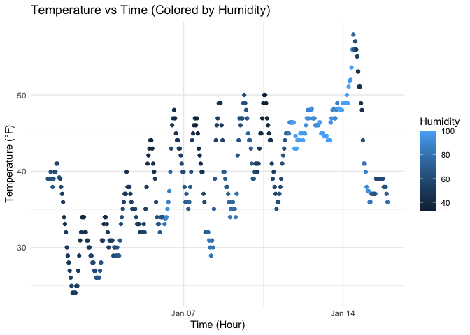

p8105_hw1_yz5248
================
yz5248
2025-09-17

## Problem 1: Dataset Description

``` r
library("moderndive")
library(ggplot2)
library(tidyverse)
```

    ## ── Attaching core tidyverse packages ──────────────────────── tidyverse 2.0.0 ──
    ## ✔ dplyr     1.1.4     ✔ readr     2.1.5
    ## ✔ forcats   1.0.0     ✔ stringr   1.5.1
    ## ✔ lubridate 1.9.4     ✔ tibble    3.2.1
    ## ✔ purrr     1.0.2     ✔ tidyr     1.3.1
    ## ── Conflicts ────────────────────────────────────────── tidyverse_conflicts() ──
    ## ✖ dplyr::filter() masks stats::filter()
    ## ✖ dplyr::lag()    masks stats::lag()
    ## ℹ Use the conflicted package (<http://conflicted.r-lib.org/>) to force all conflicts to become errors

``` r
data("early_january_weather")
```

``` r
??early_january_weather
nrow(early_january_weather)
```

    ## [1] 358

``` r
ncol(early_january_weather)
```

    ## [1] 15

``` r
round(mean(early_january_weather$temp), 1)
```

    ## [1] 39.6

The `early_january_weather` dataset comes from the **moderndive**
package and contains hourly weather data collected at LaGuardia Airport
(LGA) in early January 2013.

This dataset has **358** rows and **15** columns.  
Key variables include:  
-‘origin’: Weather station identifier (all are “EWR”, Newark Liberty
Airport).  
-‘year, month, day, hour’: Date and time information for each
observation.  
-‘temp’: Temperature in degrees Fahrenheit.  
-‘dewp’: Dewpoint in degrees Fahrenheit.  
-‘humid’: Relative humidity (percent).  
-‘wind_dir’: Wind direction in degrees.  
-‘wind_speed’: Wind speed in mph.  
-‘wind_gust’: Wind gust in mph (may contain missing values).  
-‘precip’: Precipitation (inches).  
-‘pressure’: Sea-level pressure (millibars).  
-‘visib’: Visibility (miles).  
-‘time_hour’: Date/time as a POSIXct variable for easier plotting and
analysis.

The mean temperature during this period was **39.6 °F**.

## Problem 1: Scatterplot of Temperature vs Time

``` r
# Create scatterplot
scatter_temp_time <- ggplot(early_january_weather, aes(x = time_hour, y = temp, color = humid)) +
  geom_point() +
  labs(
    title = "Temperature vs Time (Colored by Humidity)",
    x = "Time (Hour)",
    y = "Temperature (°F)",
    color = "Humidity"
  ) +
  theme_minimal()

# Print plot so it shows up in the knitted document
scatter_temp_time
```

<!-- -->

``` r
# Save plot as PNG file in your project directory
ggsave("scatter_temp_time.png", scatter_temp_time, width = 7, height = 5)
```

The scatterplot shows hourly temperature over time, with point colors
indicating humidity levels. Several patterns are apparent:  
1. Daily cycles: Temperatures follow a roughly repeating daily pattern —
lower in the early morning hours and higher during the day.  
2. Gradual warming: Overall temperatures tend to increase over the
two-week period, with the warmest temperatures occurring around January
13–14.  
3. Humidity relationship: Points with darker colors (lower humidity)
generally correspond to higher temperatures, while lighter blue points
(higher humidity) appear at cooler temperatures.  
4. Variation: There is some day-to-day variability, but the general
trend shows a gradual rise followed by a slight drop near the end.

## Problem 2: Variable Types and Coercion

Create the data frame.

``` r
set.seed(123) # for reproducibility

my_df <- tibble::tibble(
  norm_sample = rnorm(10),                      # numeric: random N(0,1)
  positive = rnorm(10) > 0,                     # logical: TRUE/FALSE
  char_vec    = sample(letters[1:3], 10, TRUE), # character vector
  factor_vec  = factor(sample(c("low","med","high"), 10, TRUE))
)

my_df
```

    ## # A tibble: 10 × 4
    ##    norm_sample positive char_vec factor_vec
    ##          <dbl> <lgl>    <chr>    <fct>     
    ##  1     -0.560  TRUE     c        high      
    ##  2     -0.230  TRUE     b        low       
    ##  3      1.56   TRUE     a        high      
    ##  4      0.0705 TRUE     c        med       
    ##  5      0.129  FALSE    a        low       
    ##  6      1.72   TRUE     a        med       
    ##  7      0.461  TRUE     b        low       
    ##  8     -1.27   FALSE    c        low       
    ##  9     -0.687  TRUE     c        high      
    ## 10     -0.446  FALSE    a        low

Take the mean by pull.

``` r
mean(my_df %>% pull(norm_sample))  # works: numeric data
```

    ## [1] 0.07462564

``` r
mean(my_df %>% pull(positive))  # works: TRUE=1, FALSE=0 -> proportion > 0
```

    ## [1] 0.7

``` r
# mean(my_df %>% pull(char_var)) will get an error output. Since char_var is a character vector (contains text like "a", "b"), mean() can only work with numeric or logical data.
# mean(my_df %>% pull(factor_var)) will get an error output. Since factor_var is a character vector (contains text like "high", "low"), mean() can only work with numeric or logical data.
```

Coercion using as.numeric.

``` r
as.numeric(my_df$positive)
```

    ##  [1] 1 1 1 1 0 1 1 0 1 0

``` r
as.numeric(my_df$char_vec)
```

    ## Warning: NAs introduced by coercion

    ##  [1] NA NA NA NA NA NA NA NA NA NA

``` r
as.numeric(my_df$factor_vec)
```

    ##  [1] 1 2 1 3 2 3 2 2 1 2

``` r
mean(as.numeric(my_df$positive))
```

    ## [1] 0.7

``` r
mean(as.numeric(my_df$char_vec))
```

    ## Warning in mean(as.numeric(my_df$char_vec)): NAs introduced by coercion

    ## [1] NA

``` r
mean(as,numeric(my_df$factor_vec))
```

    ## Warning in mean.default(as, numeric(my_df$factor_vec)): argument is not numeric
    ## or logical: returning NA

    ## [1] NA

For Logical variable (positive): When converted to numeric, TRUE becomes
1 and FALSE becomes 0.Therefore, mean(positive) gives the proportion of
values greater than 0.  
Character variable (char_vec): When converted to numeric, R cannot
convert letters into For numbers and returns NA with a warning (NAs
introduced by coercion).This explains why mean(char_vec) produces an
error — characters cannot be averaged.  
For Factor variable (factor_vec): When converted to numeric, R returns
the underlying integer codes for factor levels (e.g., 1, 2, 3).Taking
the mean of these codes is possible, but it is not meaningful because
these numbers represent level order, not actual quantities.
